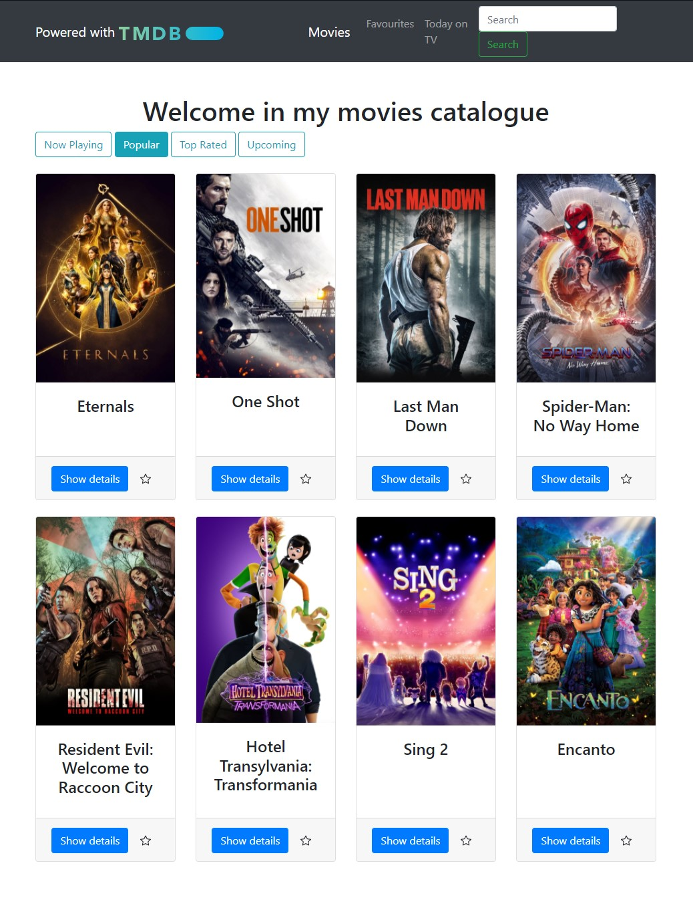
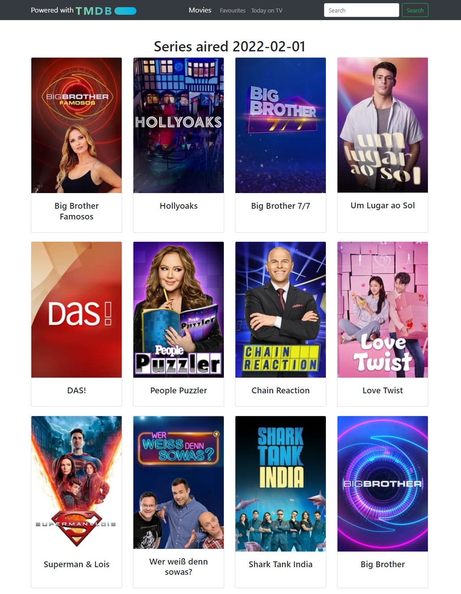
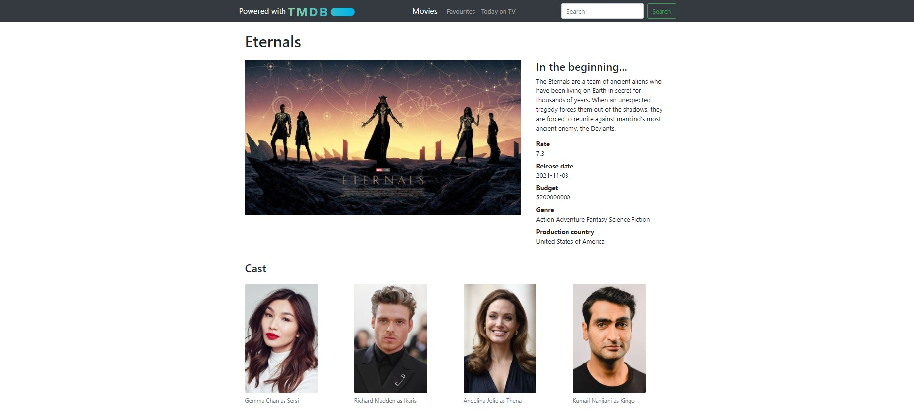
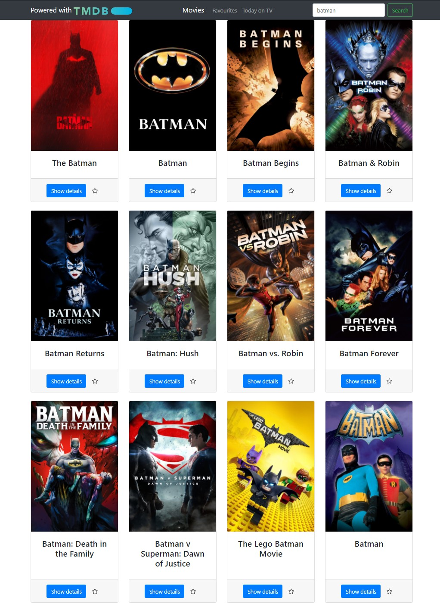
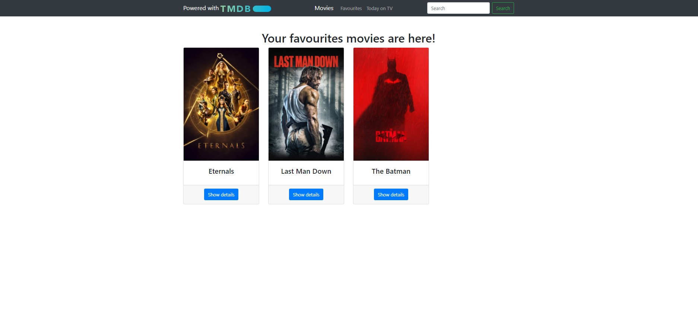

# Movies Website
Website with movies catalogue from TMDB API

See this website here: https://tmdbalpul.herokuapp.com

# Installation
* 1 - clone repo https://github.com/albertopul/movies-website
* 2 - create a virtual environment and activate
*  - pip install virtualenv
*  - virtualenv envname
*  - envname\scripts\activate
* 3 - cd into project folder
* 4 - pip install -r requirements.txt
* 5 - python main.py

# Features
* Browse movies and series database imported from TMDB API
* Add movies to favourites
* Search for movies and series

# Tech Stack
* Python
* Flask
* Bootstrap

# Home Page
  

# Series Page
  

# Single Movie Page
  

# Search Results
  

# Favourites Page

